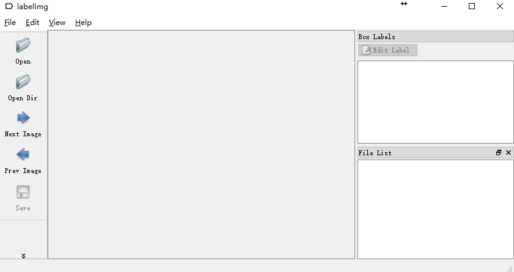
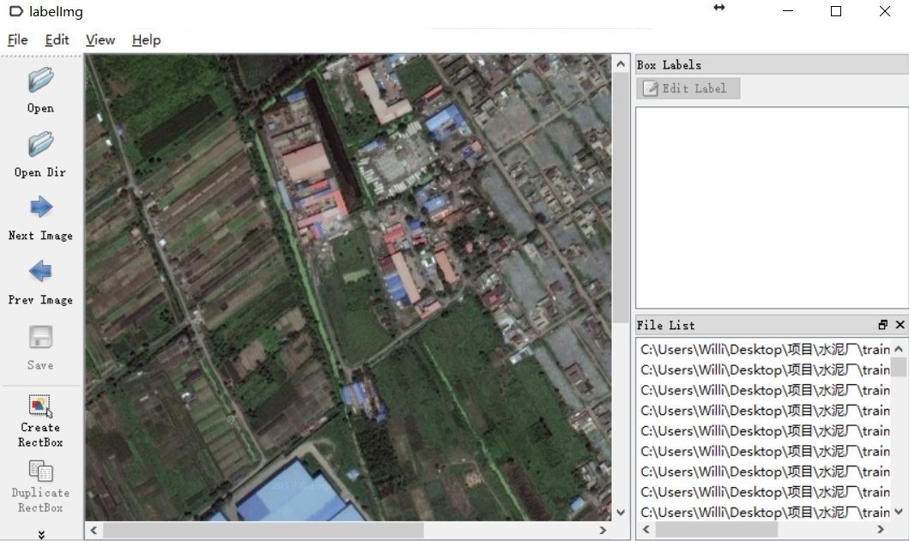
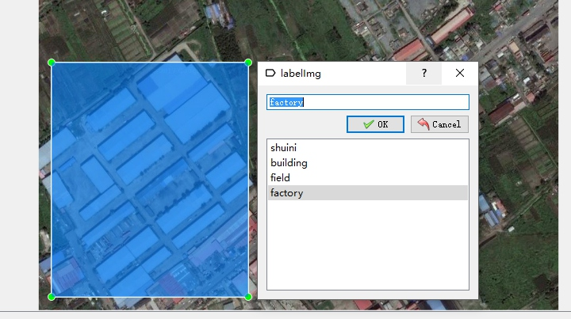
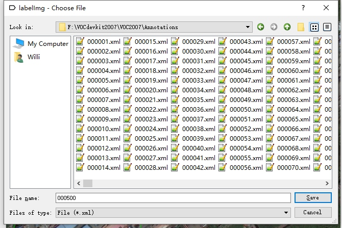

标注工具：[labelImg](https://github.com/tzutalin/labelImg)
工具的BUG：路径和保存名字不能出现中文。
训练数据尽可能统一图片类型，jpg或png，若二者混有，是意见很麻烦的事情。
注意：这里生成的xml和VOC内容格式存在不同，但不影响训练
<!-- more -->
```python
# -*- coding: utf-8 -*-
# python 图片重命名,000000.png,...,000156.png,...。
# 并写入txt文件，在训练或测试中会用到
import os
pos = 6
i=500 #start
path = 'C:\\Users\\Willi\\Desktop\\MyProject\\shuiniMaster\\trainadd1'
f=open('test.txt','w')
for file in os.listdir(path):
    if os.path.isfile(os.path.join(path,file))==True:
            ze=pos-len(str(i))
            num='0'*ze+str(i)
            f.write(num+"\n")
            numstr='0'*ze+str(i)+'.png'
            newname=file.replace(file,numstr)
            os.rename(os.path.join(path,file),os.path.join(path,newname))
            print (num,'ok')
            i=i+1
```
```matlab
%maltab 对图像png转jpg
%注意修改下面路径
imgfilepath='C:/Users/Willi/Desktop/MyProject/shuiniMaster/trainadd1/';
imgfile=dir(imgfilepath); 
numOfxml=length(imgfile)-2;%减去.和..  总的数据集大小
for i=1:numOfxml
     imgname=imgfile(i+2).name;
     img=imread(imgname);
     name=strcat(imgname(1:6),'.jpg');
     imwrite(img,name);
end
```

1.修改predefined_classes.txt：
dog，cat，car...改成你自己定义的类：shuini building field factory


3.Open Img Dir：

4.表框选类型


5.保存xml



标注快捷键：
**
Ctrl+N	Create a rect box
Ctrl+S save xml
**


### Google map api


